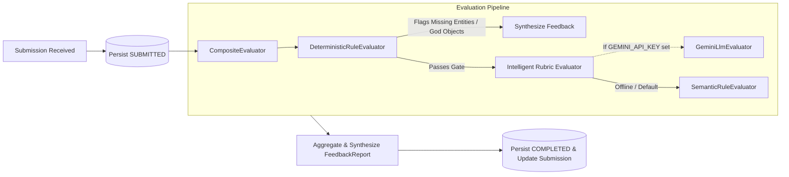

# LLD Practice Platform 📐

> A focused, production-grade prototype that helps software engineers practice **Low-Level Design (LLD)**, submit solutions across structured dimensions, and receive **explainable, evidence-based rubric feedback** with iterative attempt tracking.

Built for the **2-Day Engineering Assignment & Candidate Evaluation**.

---

## 🚀 Quick Start (Running Locally)

### Prerequisites
- **Node.js** v18+ (tested on Node v22.19.0)
- **npm** v9+ (tested on npm v10.9.3)

### 1. Run Backend Service
```bash
cd backend
npm install
npm run dev
```
Backend starts on: `http://localhost:4000` (API & Health Check at `http://localhost:4000/health`)

### 2. Run Frontend Client
In a new terminal:
```bash
cd frontend
npm install
npm run dev
```
Frontend runs on: `http://localhost:3000` (automatically proxies `/api` calls to the backend).

### 3. Run Automated Tests
```bash
cd backend
npm test
```
Runs 5 comprehensive automated test suites verifying domain invariants, state machines, deterministic checks, and end-to-end iteration tracking.

---

## 🎯 The Core Learner Journey

$$\text{Select Problem} \longrightarrow \text{Think \& Design} \longrightarrow \text{Submit} \longrightarrow \text{Rubric Feedback} \longrightarrow \text{Compare History} \longrightarrow \text{Refactor (Attempt 2)}$$

1. **Problem Selection**: Choose from classic LLD problems (*Multi-Level Parking Lot*, *Elevator Control System*, *Automated Vending Machine*).
2. **Design Studio**: Express architectural decisions across 4 structured dimensions:
   - **Scope & Assumptions**: Functional & non-functional constraints (concurrency, capacity, boundaries).
   - **Entities & Interfaces**: High cohesion classes, interface contracts, and method signatures.
   - **Design Patterns & Trade-offs**: Explicit pattern justifications (e.g. Strategy for pricing, State for elevator/machine).
   - **Class Diagram / Code**: Mermaid class relationships and pseudocode skeletons.
3. **One-Click Demonstrations**:
   - **"Load Starter Scaffolding"**: Scaffolds the problem structure for quick drafting.
   - **"Load Sample Architecture"**: Loads a canonical, multi-pattern architecture for instant evaluation testing.
4. **Explainable Evaluation Report**:
   - Rubric schema: `criterion -> score (1-5) -> evidence -> concern -> suggestion -> confidence`.
   - Cites actual evidence quotes from the candidate's submission.
5. **Attempt Progression Tracking**:
   - History drawer compares Attempt 1 vs Attempt 2 with score deltas (`+36%`) to reinforce iterative improvement.

---

## 🏛️ System Architecture & Domain Model

The platform is designed following **Domain-Driven Design (DDD)** and **Clean Architecture**:

```
backend/
├── src/
│   ├── domain/                         # Enterprise Business Rules & Models
│   │   ├── enums/                      # Difficulty, RubricDimension, SubmissionStatus, etc.
│   │   ├── models/                     # Problem, Attempt, Submission, Evaluation, Rubric, FeedbackReport
│   │   ├── repositories/               # IProblemRepository, IAttemptRepository, ISubmissionRepository
│   │   └── services/                   # IEvaluator strategy interface
│   ├── application/                    # Application Business Rules (Use Cases)
│   │   └── usecases/                   # StartAttempt, SubmitSolution, GetHistory, ListProblems
│   ├── infrastructure/                 # Frameworks, Evaluators & Repositories
│   │   ├── evaluators/                 # DeterministicRuleEvaluator, SemanticRuleEvaluator, GeminiLlmEvaluator, CompositeEvaluator
│   │   ├── repositories/               # InMemoryProblemRepository, InMemoryAttemptRepository, etc.
│   │   └── seed/                       # Rich seed problem catalog with starter templates & sample architectures
│   └── presentation/                   # Interface Adapters (Express Controllers & Routes)
│       ├── controllers/
│       └── routes/
└── tests/                              # Automated Unit & Integration Tests (Vitest)
```

---

## 🧪 Evaluation Architecture & Extensibility



### Pluggable Evaluators
1. **`DeterministicRuleEvaluator`**: Validates schema compliance, entity counts, interface declarations, missing core domain entities, and God Object anti-patterns.
2. **`SemanticRuleEvaluator` (Offline Heuristic Engine)**: High-precision semantic analyzer assessing coupling, cohesion, design patterns, and concurrency safeguards without external API dependencies.
3. **`GeminiLlmEvaluator`**: Optional zero-shot LLM evaluator. Automatically activates when `GEMINI_API_KEY` is provided in `.env`, falling back gracefully to the heuristic engine if disconnected.
4. **`CompositeEvaluator`**: Unifies deterministic rules and intelligent rubric feedback into an explainable report.

---

## 💡 Candidate Helping Guide Answers

### Change Test A
> *Today the learner submits text. Later the platform supports a class diagram. How much of your domain model changes?*
- **Answer: 0 changes to `Attempt`, `Problem`, `Evaluation`, or the practice loop.**
- **Implementation**: Submissions accept an abstract `ISubmissionPayload`. Currently implemented as `StructuredTextPayload` and `DiagramPayload`. Adding interactive canvas or code execution merely requires adding a new payload implementation implementing `toTextSummary()`.

### Change Test B
> *Today feedback comes from one evaluator. Later you add a rule-based evaluator or human review. Can you add it without rewriting the practice flow?*
- **Answer: Yes, without modifying a single line in the practice flow or use cases.**
- **Implementation**: The practice use case (`SubmitSolutionUseCase`) depends solely on the abstract `IEvaluator` interface via Dependency Injection. Any evaluator (e.g. `HumanReviewEvaluator`, `LinterEvaluator`) can be plugged into `CompositeEvaluator` without touching the domain layer.

### Practical Scale & State Handling
1. **Submission-First Persistence**: Submissions are saved immediately with status `SUBMITTED` *before* the evaluator executes. If an evaluator fails or times out, the user's work is never lost.
2. **Idempotency Guard**: Submissions enforce idempotency keys. Retrying a submission returns the existing evaluation without duplicate processing.
3. **Async Worker Ready**: At scale, the evaluation pipeline is decoupled via a job queue (e.g. BullMQ / Redis) where the API acknowledges `SUBMITTED` and workers transition the state to `COMPLETED`.

---

## 📁 Key Documentation Deliverables

- [**docs/RESEARCH.md**](file:///e:/Cipher%20School/docs/RESEARCH.md): 1–2 page research note detailing the learner problem, existing tools (LeetCode, GitHub, Educative), key market gaps, and product direction.
- [**docs/DESIGN.md**](file:///e:/Cipher%20School/docs/DESIGN.md): Detailed architectural design note, domain model, trade-offs, and Change Test answers.
- [**docs/AI_USAGE.md**](file:///e:/Cipher%20School/docs/AI_USAGE.md): Detailed log of 5 meaningful AI-assisted decisions (what was suggested, accepted/rejected, and engineering rationale).
- [**backend/tests/domain_and_evaluation.test.ts**](file:///e:/Cipher%20School/backend/tests/domain_and_evaluation.test.ts): Vitest test suite testing state transitions, idempotency, evaluators, and iteration progression.
