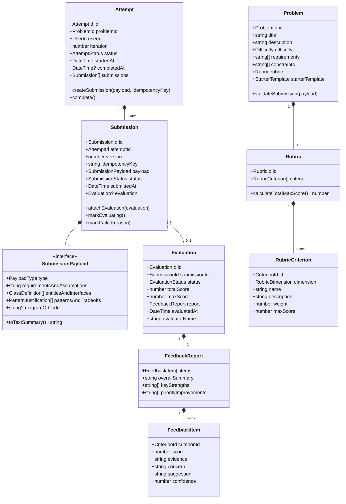
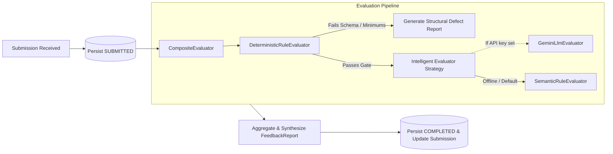

# Design Note: LLD Practice Platform Architecture & Domain Model

**Author:** Aryaman Malik  
**Scope:** MVP Architecture, Domain Model, Evaluation Pipeline, Change Tests, and Engineering Trade-offs  
**Date:** September 2026  

---

## 1. System Overview & Practice Loop

The LLD Practice Platform is engineered around a focused, deliberate learning loop:
1. **Explore & Select Problem**: Learner selects a classic LLD challenge (e.g., *Parking Lot*, *Elevator System*, *Vending Machine*) with crisp functional requirements, constraints, and scoring rubrics.
2. **Design & Formulate**: Learner articulates their design across structured dimensions (Requirements/Assumptions, Entities & Signatures, Design Patterns & Trade-offs, and optional Diagram/Code).
3. **Submit & Persist**: Submission is immutably recorded with an idempotency key and placed into `SUBMITTED` state before evaluation initiates, ensuring zero data loss.
4. **Evaluate via Composite Pipeline**: Evaluation engine conducts deterministic sanity validation followed by structured rubric analysis (`SUBMITTED` $\to$ `EVALUATING` $\to$ `COMPLETED`).
5. **Review Evidence-Based Feedback**: Learner receives criterion-by-criterion critique highlighting evidence quotes, concerns, and concrete suggestions.
6. **Iterate & Compare**: Learner creates subsequent attempts to address previous weaknesses and inspects attempt progression over time.

---

## 2. Core Domain Model (Clean Architecture & LLD)



### Domain Responsibilities Breakdown:
- **`Problem`**: Holds problem specifications, constraints, rubric definitions, and evaluation rules. Owns domain validation for problem requirements.
- **`Attempt`**: Aggregates a learner's progression on a specific problem across one or more iterations. Tracks overall practice state.
- **`Submission`**: An immutable snapshot of a learner's work at a specific point in time. Manages its own lifecycle states (`SUBMITTED` $\to$ `EVALUATING` $\to$ `COMPLETED` / `FAILED`).
- **`Evaluation`**: Contains the formal outcome of an evaluation run. Encapsulates score aggregation and links to the comprehensive `FeedbackReport`.
- **`Rubric` & `RubricCriterion`**: Defines what constitutes good design across standard dimensions (*SRP*, *Coupling*, *Abstractions*, *Edge Cases*).
- **`FeedbackReport` & `FeedbackItem`**: Carries explainable critique strictly adhering to the schema: `criterionId -> score -> evidence -> concern -> suggestion -> confidence`.

---

## 3. Evaluation Engine Architecture (Strategy & Composite Pattern)



### Evaluator Interface Contract:
```typescript
export interface IEvaluator {
  readonly name: string;
  evaluate(problem: Problem, submission: Submission): Promise<FeedbackReport>;
}
```

1. **`DeterministicRuleEvaluator`**:
   - Executes fast deterministic checks:
     - Minimum required entities defined (e.g. `ParkingLot`, `ParkingSpot`, `Vehicle`, `Ticket`).
     - Method presence and interface definitions.
     - Anti-pattern detection (e.g. God Object with >10 unrelated responsibilities).
     - Missing requirements/assumptions section.
2. **`SemanticRuleEvaluator` (Heuristic Engine)**:
   - Provides 100% offline, deterministic semantic design evaluation.
   - Evaluates coupling (checking whether business classes directly hardcode storage/payment or use abstractions), extensibility (presence of Strategy/Factory/State patterns), and edge cases.
3. **`GeminiLlmEvaluator` (Live AI Engine)**:
   - Formulates a zero-shot structured prompt using the exact rubric criteria.
   - Forces structured JSON output conforming to our schema.
   - Gracefully falls back to `SemanticRuleEvaluator` if API call fails or times out.
4. **`CompositeEvaluator`**:
   - Coordinates the pipeline, merges deterministic validation results with semantic/LLM reasoning, and generates the final unified `FeedbackReport`.

---

## 4. Addressing Change Tests (Extensibility)

### Change Test A: Supporting Alternative Submission Formats (e.g., Class Diagram / Code)
*Question: Today the learner submits text. Later the platform supports a class diagram. How much of your domain model changes?*
- **Answer: Zero changes to `Attempt`, `Problem`, `Evaluation`, or the practice loop.**
- **Rationale**: `Submission` accepts an abstract `SubmissionPayload`. Currently, `StructuredTextPayload` implements this interface. To support interactive Class Diagrams (e.g., PlantUML or Mermaid JSON) or Code (e.g., Java/TypeScript files), we simply introduce:
  ```typescript
  export class DiagramSubmissionPayload implements SubmissionPayload {
    readonly type = PayloadType.DIAGRAM;
    constructor(public readonly diagramNodes: Node[], public readonly edges: Edge[], ...) {}
    toTextSummary(): string { /* extracts class & relation descriptors for evaluators */ }
  }
  ```
  The evaluators inspect `payload.type` or consume `payload.toTextSummary()`. The domain entities and state machine remain completely untouched.

### Change Test B: Adding New Evaluators (e.g., Rule-based or Human Review)
*Question: Today feedback comes from one evaluator. Later you add a rule-based evaluator or human review. Can you add it without rewriting the practice flow?*
- **Answer: Yes, without changing a single line in the practice flow or use cases.**
- **Rationale**: The practice use case (`SubmitSolutionUseCase`) depends solely on the abstract `IEvaluator` interface injected via Dependency Injection:
  ```typescript
  export class HumanReviewEvaluator implements IEvaluator {
    readonly name = "HumanReviewEvaluator";
    async evaluate(problem: Problem, submission: Submission): Promise<FeedbackReport> {
      // places submission into pending human review queue and returns pending/completed report
    }
  }
  ```
  We can swap, chain, or combine any evaluator inside `CompositeEvaluator` without touching `Attempt`, `Submission`, or API controllers.

---

## 5. Practical Scale & Fault Tolerance Decisions

1. **Submission-First Persistence**:
   - The submission is saved to the database immediately with status `SUBMITTED` *before* the evaluator is invoked.
   - If an LLM call crashes or times out, the submission is never lost. The state transition moves to `FAILED` with an explanatory error, allowing safe retry.
2. **Idempotency Guard**:
   - Submissions take a client-generated or server-computed `idempotencyKey` (`attemptId + hash(payload)`).
   - If a learner double-clicks or experiences network retry, the platform returns the existing submission/evaluation rather than duplicating expensive evaluator runs.
3. **Graceful Degraded Mode**:
   - If external AI connectivity is unavailable, the `CompositeEvaluator` seamlessly falls back to the deterministic/heuristic evaluator. Evaluation never hangs or hard-fails for the user.
4. **Simplest Component to Separate First at Scale**:
   - If traffic grows, the **Evaluation Pipeline** is the first candidate to split into an asynchronous worker (e.g., BullMQ / Redis message queue). The API service writes `SUBMITTED` and enqueues a job; workers evaluate and publish `COMPLETED`. The client polls or listens via SSE/WebSocket.

---

## 6. Key Design Trade-offs

| Decision | Alternative Considered | Chosen Approach | Rationale |
| :--- | :--- | :--- | :--- |
| **Submission Input** | Free-form unstructured text | Structured 4-quadrant canvas (Scope, Entities, Patterns, Diagram) | Free-form text leads to vague ramblings that cannot be systematically analyzed against rubrics. Structured input mirrors real-world interview synthesis and produces higher quality evidence. |
| **Evaluation Strategy** | 100% LLM prompt ("Grade this") | Composite: Deterministic rules + Structured Rubric analysis | Pure LLM prompts hallucinate arbitrary 100-point scores and fluctuate wildly across retries. Combining deterministic syntax/contract checks with rubric-constrained qualitative reasoning produces consistent, actionable feedback. |
| **Architecture** | Microservices with Kafka | Modular Monolith (Clean Architecture) | The assignment explicitly cautions against premature distributed systems. A modular monolith provides crystal-clear domain boundaries with zero operational overhead. |
